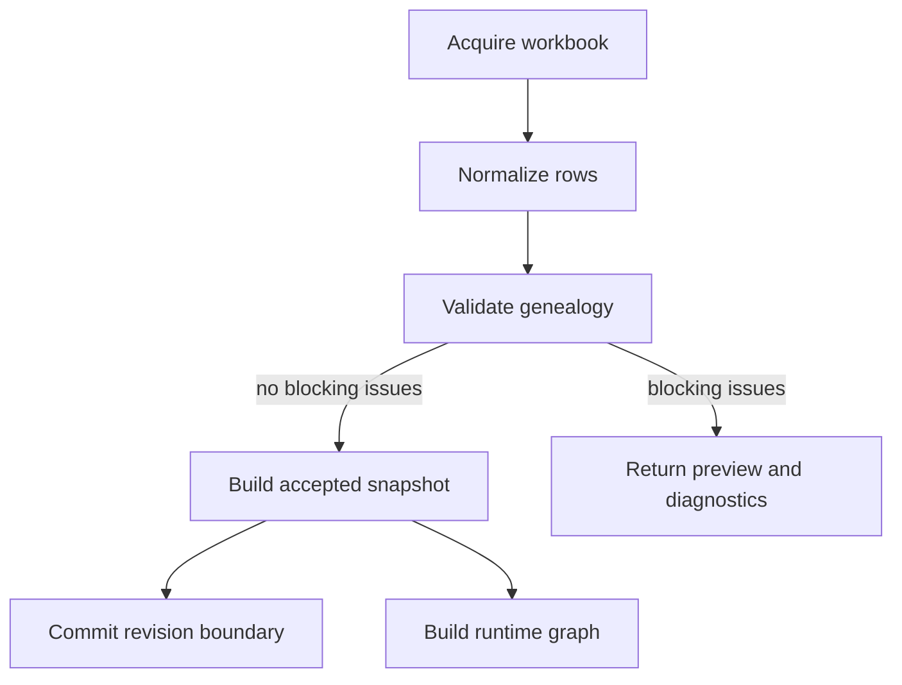
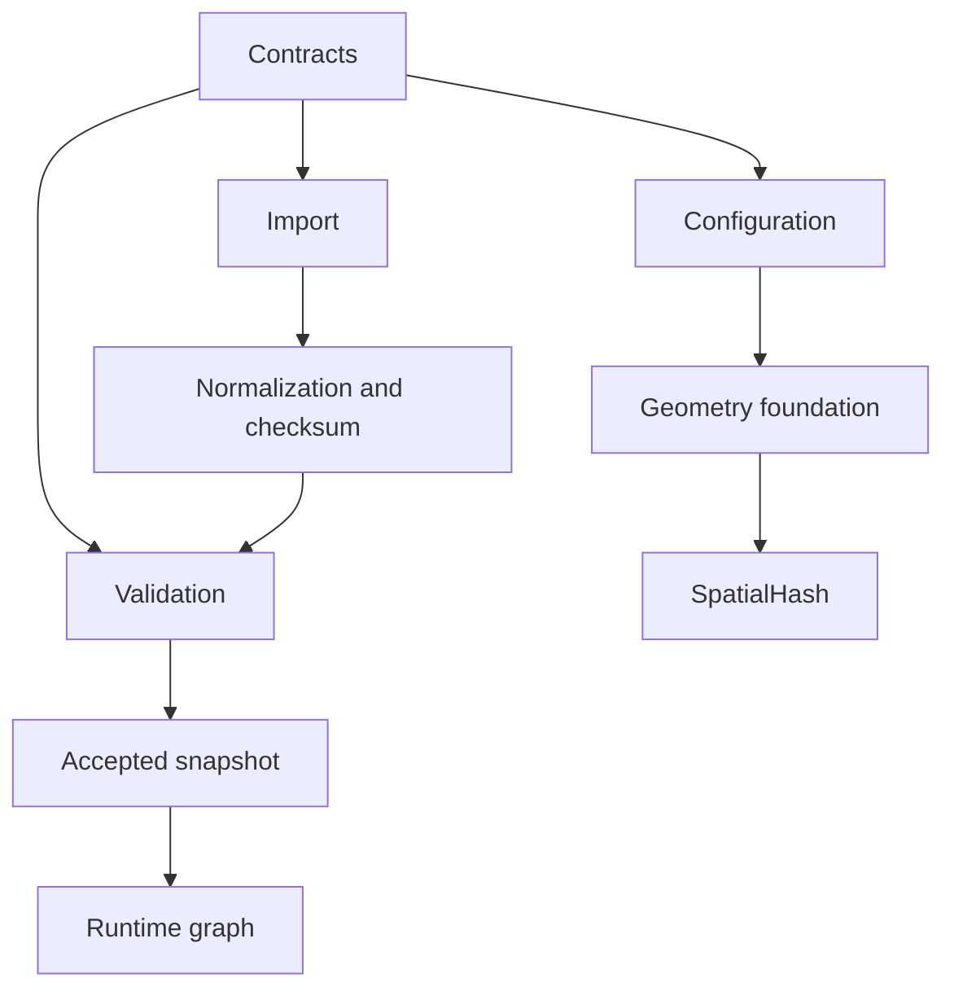

# Milestone 1 Architecture

## Comprehension

Lubanda treats genealogy as authoritative source data and visual growth as a
deterministic downstream interpretation. Milestone 1 establishes the immutable
boundary before layout: safely acquire a workbook, normalize without changing
kinship, report all validation issues, and create a serializable snapshot only
from an accepted validation report. A runtime graph then provides indexed access
without leaking `Map` objects into persistence.

Geometry is independent of genealogy and rendering. It defines finite-number
semantics, closed bounds, classified segment contacts, polygons, and adaptive
cubic Bézier sampling. `SpatialHash` consumes those bounds and guarantees
deterministic, deduplicated queries. Later milestones may depend on these
foundations; none of their solvers or visual concerns appear here.

## Lifecycle

The commit operation is a typed port only. Persistent revision storage is outside
Milestone 1, so this package cannot silently commit data.

## Dependency Graph

There is no dependency from genealogy to rendering, nor from geometry to UI.
The snapshot builder consumes the discriminated `ValidationReport`; a rejected
report throws and cannot cross the accepted-snapshot boundary.

## Determinism Boundaries

- Canonical ordering is display order, source row, then normalized ID.
- Canonical text is NFC; search normalization is separate.
- Checksums serialize fixed normalized-row keys, explicit nulls, and canonical
  row order before UTF-8 SHA-256.
- Graph child arrays and root arrays use canonical ordering.
- Spatial queries deduplicate across cells and return lexicographically sorted IDs.
- Geometry uses a documented absolute epsilon and validates all public inputs.

