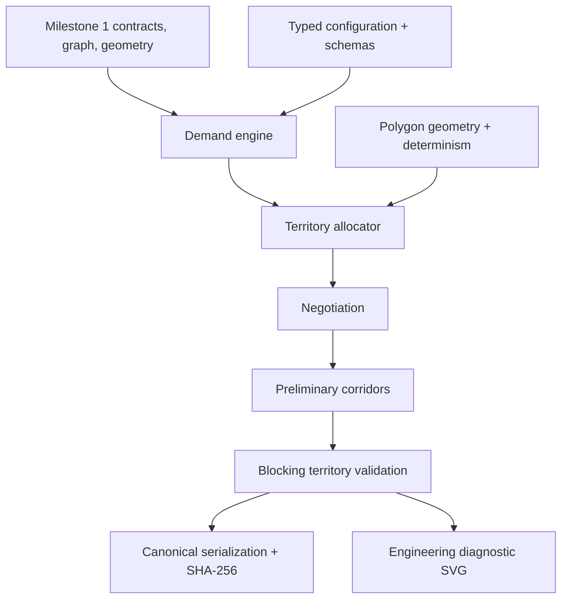

# Milestone 2 dependency graph

Production dependency direction is one-way. Tests and scripts may compose
public modules but production modules do not import test fixtures or scripts.
The Milestone 1 `spatial` module remains available but territory allocation does
not persist its runtime index.
