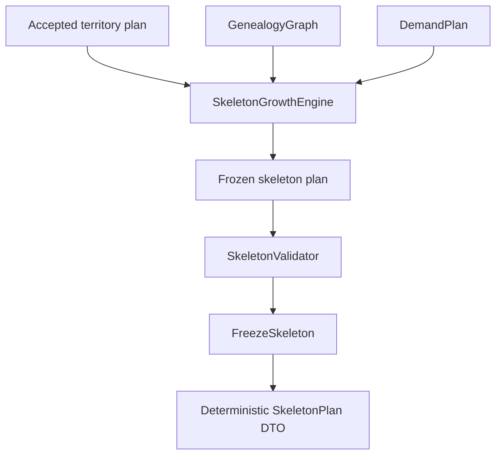
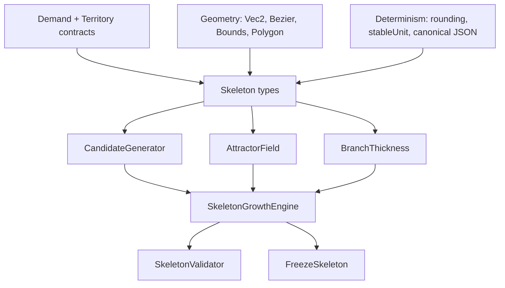

# Milestone 3 — Skeleton Growth Architecture

## Scope

Milestone 3 implements the skeleton growth phase that transforms an accepted
territory plan into a deterministic, organic, recursive branching structure.
No routing, collision solving, labels, AI, or rendering is included.

## Pipeline

## Core algorithm

1. **Trunk centerline**: A vertical spine is grown from the root entry
   reservation center, passing upward through each junction zone (sorted
   by Y-coordinate). Each segment between junctions is a seeded cubic
   Bezier curve. The trunk terminates in a canopy-extension segment.

2. **Junction planning**: Each reserved junction zone is mapped to a trunk
   node. The mapping records the junction zone ID, trunk node ID, lineage
   root ID, trunk point, and corridor ID.

3. **Recursive skeleton growth**: For each major lineage (direct child of
   the selected root), a branch is grown from its trunk junction toward the
   lineage's territory centroid. Within each lineage, the genealogy tree is
   traversed recursively: every person in the selected-root subtree receives
   a branch segment. Branches terminate at territory centroids or extend
   naturally in the parent direction.

4. **Candidate generation**: Each branch is generated as `candidateCount`
   cubic Bezier curves with seeded control-point jitter. Control points are
   influenced by attractor fields, parent direction, and organic variation.

5. **Hard candidate rejection**: Candidates are rejected if they violate:
   - Minimum branch length (`minimumBranchLength`)
   - Maximum curvature (`maxCurvature`)
   - Template polygon containment
   - Territory polygon containment
   - Existing branch intersection

6. **Deterministic candidate scoring**: Valid candidates receive a
   composite score (0–1) combining smoothness, naturalness, direction
   continuity, length efficiency, and attractor alignment.

## Determinism

- All pseudo-random variation uses `stableUnit()` with the configured
  seed and context-specific keys.
- Floating-point coordinates are rounded to 6 decimal places.
- The final `SkeletonPlan` is fingerprinted via SHA-256 of a canonical
  JSON representation of the plan's structural fields.
- Repeated growth with the same seed, snapshot, territory plan, and
  configuration produces byte-identical output.

## Dependencies

## Created files

- `src/core/skeleton/types.ts`
- `src/core/skeleton/AttractorField.ts`
- `src/core/skeleton/BranchThickness.ts`
- `src/core/skeleton/CandidateGenerator.ts`
- `src/core/skeleton/SkeletonGrowthEngine.ts`
- `src/core/skeleton/index.ts`
- `src/core/layout/SkeletonValidator.ts`
- `src/core/layout/FreezeSkeleton.ts`
- `src/core/layout/index.ts`
- `schemas/skeleton-plan.schema.json`
- `scripts/generate-skeleton-diagnostic-svg.ts`

## Modified Milestone 2 files

- `src/index.ts` — added skeleton and layout exports
- `src/core/contracts/identifiers.ts` — added SkeletonBranchId, SkeletonPlanId
- `src/core/contracts/issues.ts` — added SKELETON_ISSUE_CODES
- `src/core/contracts/solve-stage.ts` — added MILESTONE_3_STAGES
- `schemas/error-codes.schema.json` — added skeleton issue codes and M3 stages

## Not implemented

- Routing (final branch centerline fitting)
- Collision solving (branch-to-branch clearance)
- Labels (text placement)
- Bark / leaves / ornaments
- AI style analysis
- UI / rendering / export
