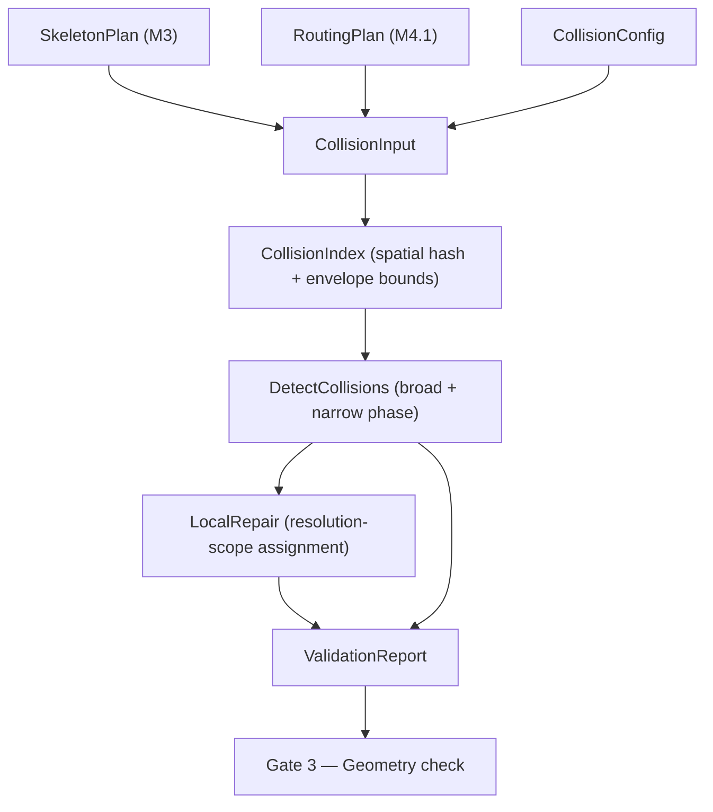
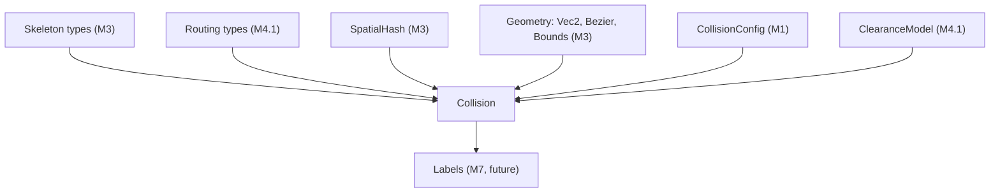

# Milestone 4.2 — Collision Safety Architecture

## Scope

Milestone 4.2 implements collision detection and deterministic local repair
for the skeleton growth and routing pipeline. It transforms an approved
SkeletonPlan and RoutingPlan into a collision-validated layout by detecting
branch–branch, branch–boundary, and self-intersection violations, then
assigning each a recommended resolution scope for downstream repair.

No label collision, stability, scale, visual, or export logic is included.

## Pipeline

## Core algorithm

1. **CollisionIndex building**: For each non-trunk branch, compute envelope
   radius using the canonical formula (`branchHalfWidth + barkAllowance +
   classClearance + safetyMargin`) from routing's ClearanceModel, sample the
   skeleton curve, expand its bounding box by the envelope radius, and insert
   into a SpatialHash for broad-phase queries.

2. **Broad phase**: Query the spatial index using the candidate branch's
   envelope bounds. Returns potential collision candidates (branches whose
   envelope bounds overlap).

3. **Adjacent exemption**: Parent-child connected edges are exempt from
   collision testing if they remain within a bounded junction region
   (configurable `adjacentJunctionRadius`).

4. **Narrow phase**: For each candidate pair, compute minimum curve-to-curve
   distance via adaptive polyline segment-to-segment distance. Compare against
   the required clearance (canonical `computeRequiredClearance` formula).

5. **Self-collision**: Long curves (length ≥ `selfCollisionMinimumLength`) are
   tested by comparing non-adjacent portions (first third vs last third of
   sampled points) of their own geometry.

6. **Boundary containment**: Sampled curve points are tested against the
   template polygon using ray-casting point-in-polygon.

7. **Local repair**: Each detected collision is assigned a resolution scope
   from the preferred order in LNGP-R3-05 §6. The resolver returns pending
   actions but does NOT mutate the skeleton or routing data.

## Determinism

- All spatial queries sort results by ID for deterministic output order.
- All collision records are sorted deterministically by branchId.
- Repeated runs with the same input produce byte-identical validation reports
  and local repair results.
- Floating-point values are rounded to 3 decimal places in collision records.

## Key design decisions

| Decision | Rationale |
|---|---|
| **Consume RoutingPlan** (not rebuild from skeleton) | Single source of truth for branch radii, safety margins; reuses existing obstacle data |
| **One canonical clearance formula** in routing's `ClearanceModel.ts` | Both routing and collision call `computeEnvelopeRadius()` from the same module |
| **No global CollisionSolver** | `resolveLocalCollisions()` is a pure function; no mutable state |
| **No skeleton mutation** by collision | Resolver only records pending actions; downstream stages perform actual geometric adjustment |
| **Configurable thresholds** | `CollisionPolicy` exposes all tuning parameters with sensible defaults |

## Inputs

- `SkeletonPlan` (approved skeleton with branches, curves, topology)
- `SkeletonBranchMap` (branch ID → SkeletonBranch)
- `RoutingPlan` (routing records with branch radii, safety margins, corridors)
- `RoutingRecordMap` (branch ID → RoutingRecord)
- `CollisionConfig` (branchClearance, labelClearance, barkAllowance)

## Outputs

- `CollisionIndex` (queryable spatial index of branch envelopes)
- `CollisionTestResult` (valid/invalid with collision records)
- `CollisionValidationReport` (accepted + collisions + metrics)
- `LocalRepairResult` (pending actions + unresolved collisions)

## Dependencies

## Created files

- `src/core/collision/types.ts`
- `src/core/collision/CollisionIndex.ts`
- `src/core/collision/CollisionEngine.ts`
- `src/core/collision/CollisionResolver.ts`
- `src/core/collision/ConstraintSolver.ts`
- `src/core/collision/index.ts`
- `schemas/collision-report.schema.json`
- `tests/unit/collision/ClearanceModel.test.ts`
- `tests/unit/collision/CollisionEngine.test.ts`
- `tests/unit/collision/ConstraintSolver.test.ts`
- `tests/unit/collision/CollisionResolver.test.ts`
- `tests/property/collision.property.test.ts`
- `tests/integration/skeleton-to-collision.test.ts`

## Modified Milestone 4.1 files

- `src/core/routing/ClearanceModel.ts` — added `computeEnvelopeRadius()`
- `src/core/contracts/solve-stage.ts` — added `MILESTONE_4_2_STAGES`
- `src/core/contracts/issues.ts` — added `COLLISION_ISSUE_CODES`
- `src/index.ts` — added collision exports
- `schemas/error-codes.schema.json` — added collision codes/stages

## Not implemented (deferred to future milestones)

- Label collision (branch–label, label–label) — Milestone 7
- Path bending / junction shifting (geometric repair) — future
- Incremental reflow (stability) — Milestone 8
- Web Workers / checkpointing — Milestone 9
- Bark / leaves / visual rendering — Milestone 10
- SVG / PNG / PDF export — Milestone 11
- AI style analysis
- UI components
