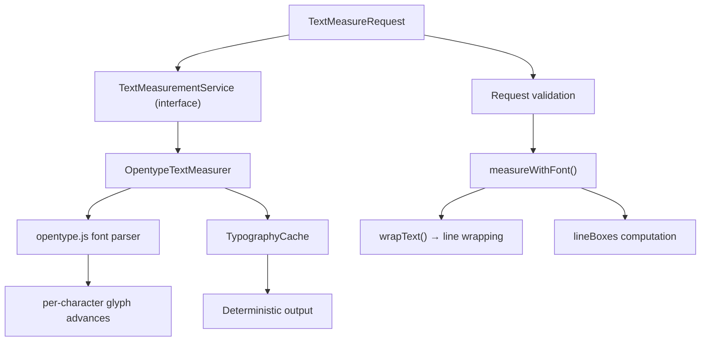
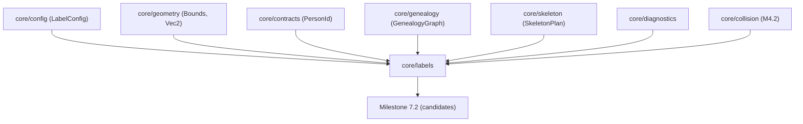

# Milestone 7.1 — Label Contracts and Arabic Text Measurement Architecture

## Scope

Milestone 7.1 implements the label contracts and deterministic Arabic text
measurement service. This is the foundation for the full Label Layout Engine
(Milestones 7.2+). It provides:

- All required types and interfaces for label placement
- A pure-JavaScript text measurement service using opentype.js
- Deterministic glyph-level measurement for Arabic and Latin text
- RTL-aware and multiline measurement
- Deterministic caching by full typography request
- Configuration for fonts, sizing, and measurement precision

No candidate generation, label placement, backtracking, leader lines,
label collision solving, terminal leaf layout, or rendering is included.

## Architecture

## Key design decisions

| Decision | Rationale |
|---|---|
| **Pure-JS Arabic shaping (ArabicShaper)** | Implements Unicode standard contextual form selection for Arabic without requiring GSUB font tables. Maps base Arabic letters to U+FE70–U+FEFC presentation forms based on joining context (isolated, initial, medial, final). |
| **Font: DejaVuSans** | Contains full Arabic presentation form glyph set (U+FE8F–U+FEFC) with distinct advance widths for initial, medial, final, and isolated forms. Bundled TTF is 760 KB, SIL Open Font License. |
| **Deterministic caching** | Cache keyed by full typography request (text, font, size, weight, spacing, direction, maxWidth, lineCountPolicy, maxLines) |
| **No character-count approximation** | Satisfies LCS-LBL-001 prohibition; uses real glyph advance widths from shaped presentation forms |
| **Font-derived line height** | Line height computed from font `ascender - descender + lineGap` scaled by fontSize/unitsPerEm, not a fixed multiplier |
| **Abstraction-first interface** | `TextMeasurementService` interface allows switching implementation (HarfBuzz, canvas, etc.) |

## Types defined

- `TextMeasureRequest` — complete typography request
- `TextMetricsResult` — width, height, baseline, line boxes, overflow flag
- `LineBox` — per-line geometry
- `TextDirection` — LTR or RTL
- `TextMeasurementService` — `measure(request)` interface
- `LabelCandidate` — candidate position for a person label
- `LabelCandidateFamily` — 6 candidate families
- `LabelPlacement` — placed label with geometry
- `LabelLayoutInput` — input for full label layout engine
- `LabelLayoutMetrics` — aggregate statistics
- `UnresolvedLabelReason` — reason a label could not be placed
- `LabelLayoutResult` — complete label layout output
- `SolveContext` — context for label solving
- `FontDescriptor` — font file info for loading
- `TypographyCacheKey` — cache key structure
- `LabelDiagnostic` — diagnostic event type

## Dependencies

## Created files

- `src/core/labels/types.ts` — all contract types
- `src/core/labels/TextMeasurer.ts` — `OpentypeTextMeasurer` implementation
- `src/core/labels/cache.ts` — `TypographyCache`
- `src/core/labels/index.ts` — barrel exports
- `schemas/label-layout-result.schema.json` — schema for serializable output
- `tests/unit/labels/TextMeasurementService.test.ts` — 38 tests
- `fonts/DejaVuSans.ttf` — bundled font
- `fonts/DejaVuSans-Bold.ttf` — bundled bold font
- `docs/architecture/milestone-7.1-architecture.md` — this document

## Modified files

- `src/core/config/types.ts` — unchanged (LabelConfig already exists)
- `src/core/contracts/solve-stage.ts` — added `MILESTONE_7_STAGES`
- `src/core/contracts/issues.ts` — added `LABEL_ISSUE_CODES`
- `src/index.ts` — added labels exports
- `schemas/error-codes.schema.json` — added label codes/stages

## Not implemented (Milestone 7.2+)

- Label candidate generation
- Label placement / solving
- Backtracking algorithm
- Leader line collision testing
- Branch–label collision integration
- Terminal leaf layout
- Cartouche zone layout
- Label rendering (deferred to Milestone 10)
